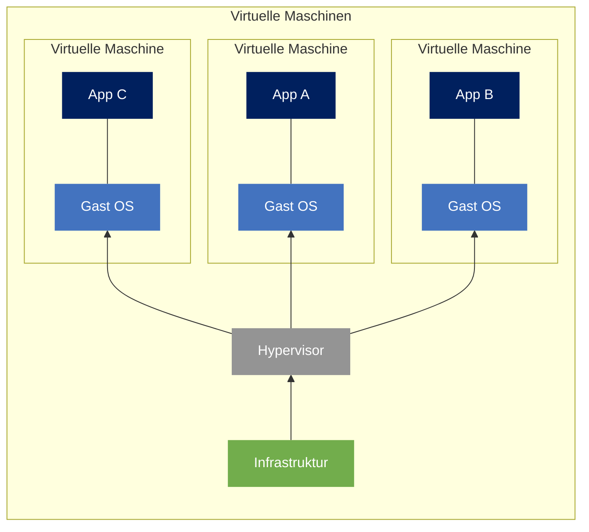
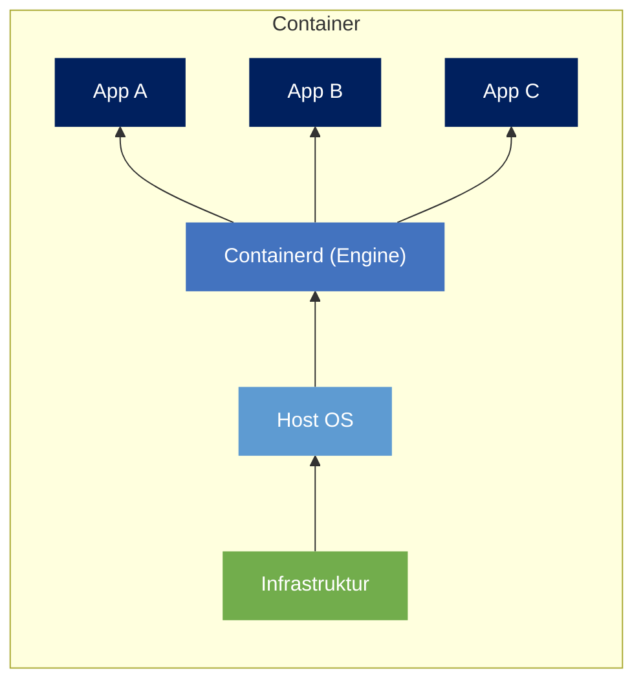

# Container

## Container vs Virtuelle Maschinen

```mermaid
flowchart BT

    %% Nodes and Contents
    subgraph "Virtuelle Maschinen"
    direction BT
        A["Infrastruktur"]
        B["Hypervisor"]

        subgraph "Virtuelle Maschine"
            CA["Gast OS"]
            DA["App A"]
        end
        subgraph "Virtuelle Maschine"
            CB["Gast OS"]
            DB["App B"]
        end
        subgraph "Virtuelle Maschine"
            CC["Gast OS"]
            DC["App C"]
        end
    end
    

    %% Connections
    A --> B
    B --> CA --- DA
    B --> CB --- DB
    B --> CC --- DC

    

    %% Styles

    style A fill:#72ad4c,color:#fff,stroke:none

    style B fill:#949494,color:#fff,stroke:none
    
    style CA fill:#4373bf,color:#fff,stroke:none
    style CB fill:#4373bf,color:#fff,stroke:none
    style CC fill:#4373bf,color:#fff,stroke:none
    
    style DA fill:#00205e,color:#fff,stroke:none
    style DB fill:#00205e,color:#fff,stroke:none
    style DC fill:#00205e,color:#fff,stroke:none

```

```mermaid
flowchart BT

    %% Nodes and Contents
    subgraph "Container"
    direction BT
        A["Infrastruktur"]
        B["Host OS"]
        C["Containerd (Engine)"]
        DA["App A"]
        DB["App B"]
        DC["App C"]
    end

    %% Connections
    A --> B
    B --> C
    C --> DA
    C --> DB
    C --> DC

    %% Styles
    style A fill:#72ad4c,color:#fff,stroke:none
    style B fill:#5e9bd2,color:#fff,stroke:none
    style C fill:#4373bf,color:#fff,stroke:none
    style DA fill:#00205e,color:#fff,stroke:none
    style DB fill:#00205e,color:#fff,stroke:none
    style DC fill:#00205e,color:#fff,stroke:none

```
