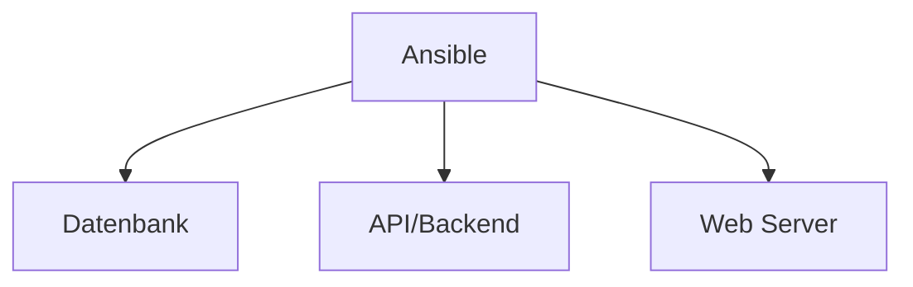

# Ansible

## Was ist Ansible

Ansible ist ein Open Source Tool, das deine IT-Infrastruktur in einfachem deklarativem Code beschreiben kann.
Es wurde 2012 von Michael Dehaan entwickelt und 2015 von RedHat&#8482; <!--Trademark--> erworben.
Es ist heutzutage neben [Terraform](https://www.terraform.io) und [Puppet](https://www.puppet.com) eines der meist benutzten Management Tools.

Es verwendet deklarativen Push-basierten YAML Code um DevOps Teams zu ermöglichen, Server zu automatisieren.



## Installation und Updates

Ansible ist in Python geschrieben. Die Installation findet dementsprechend über [`pipx`](../../languages/python/pipx/index.md) statt.

### Installiere Ansible

=== "Komplette installation (Empfohlen)"

    Volles Ansible Paket:

    ```bash
    pipx install --include-deps ansible
    ```

=== "Minimale installation"

    Nur `ansible-core` installieren:

    ```bash
    pipx install ansible-core #(1)!
    ```

    1. Mit `pipx install ansible-core==$VERSION` kann eine bestimmte Version installiert werden, beispielsweise `pipx install ansible-core==2.12.3`.
