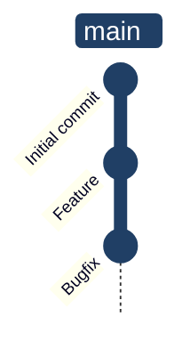
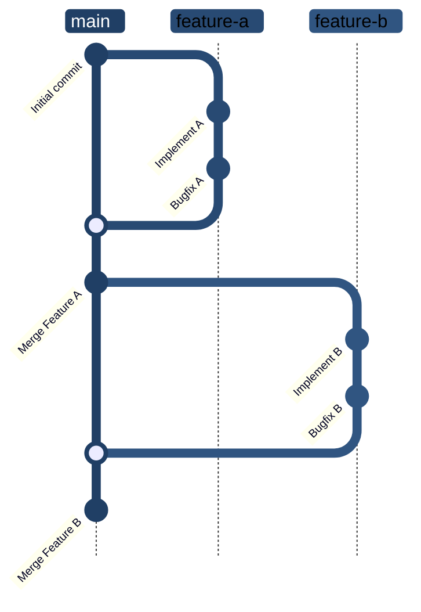
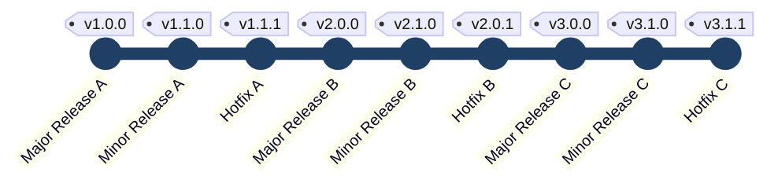

# Git Workflows

!!! info
    Für einzelne Entwickler

!!! info
    Für 2-10 Entwlicker

## Branches/Zweige

### Main

Der **main branch** (früher **master**) wird für production-releases verwendet. Fehler werden in **hotfix branches** behoben.

### Develop

Der **develop branch** wird vom **main branch** erstellt und enthält alle stabilen features für den nächsten release.

### Releases

**Release branches** werden verwendet, um Releases zu **isolieren und stabilisieren**. Fixes im Release Branch werden wieder in dem Develop Branch zusammengeführt

### Features

**Feature branches** werden **mit dem develop Branch zusammengeführt**, sobald sie **stabil und getested** sind. Es können **beliebig viele** feature branches erstellt werden. Änderungen auf dem Develop Branch müssen wieder mit den feature branches zusammengeführt werden.

### Hotfixes

**Hotfix branches** werden erstellt, um Fehler im **main branch** zu beheben.

## Tagging

