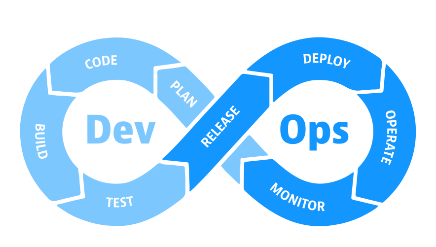

# DevOps

**DevOps** setzt sich aus **Softwareentwicklung** (Dev) und dessen **Betrieb** (Ops) zusammen. Es handelt sich dabei um eine Methode im Softwaretechnik-Bereich, die darauf abzielt, die Arbeit der Entwicklerteams (Planung &rarr; Entwicklung &rarr; Bau-Prozess → Tests) und der Betriebsteams (Veröffentlichung → Bereitstellung → Betrieb → Überwachung) miteinander zu verbinden. Das Ziel ist es, eine Kultur der Zusammenarbeit zu fördern, um den [Anwendungs-Entwicklungsprozess](https://en.wikipedia.org/wiki/Systems_development_life_cycle) zu verbessern und verkürzen.

<!-- DevOps Graphics -->

<!--

### Git Installation und Einrichtung

Installiere [Git](https://git-scm.com/download/) und [GitHub Desktop](https://desktop.github.com/)

-->