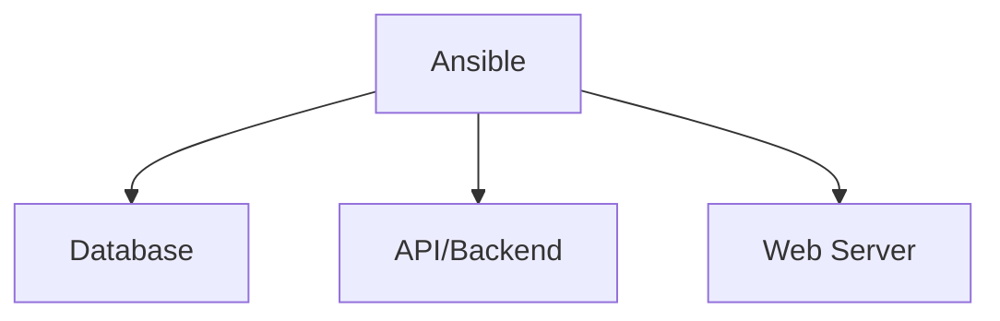

# Ansible

## What is Ansible

Ansible is an open-source tool that can describe your IT infrastructure in simple declarative code.
It was developed in 2012 by Micheal Dehaan and acquired by RedHat&#8482; <!--Trademark-->.

Alongside [Terraform](https://www.terraform.io) and [Puppet](https://www.puppet.com), it is one of the most widely used management tools today.

It uses declarative push-based YAML code to enable DevOps teams to automate servers.



## Installation and Updates

Ansible is written in Python. The installation takes place accordingly via [`pipx`](../../languages/python/pipx/index.md).

### Install Ansible

=== "Complete installation (Recommended)"

    Full Ansible Package:

    ```bash
    pipx install --include-deps ansible
    ```

=== "Minimal installation"

    Only install `ansible-core`:

    ```bash
    pipx install ansible-core #(1)!
    ```

    1. a specific version can be installed with `pipx install ansible-core==$VERSION`, for example `pipx install ansible-core==2.12.3`.
